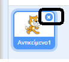
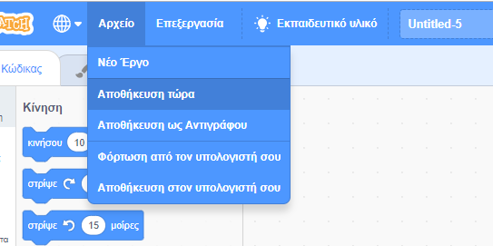

## Χαρακτήρες

Προτού ξεκινήσεις την κωδικοποίηση, θα πρέπει να προσθέσεις ένα "πράγμα" στον κώδικα. Στο Scratch, αυτά τα "πράγματα" ονομάζονται **χαρακτήρες**.

\--- task \--- Άνοιξε ένα νέο έργο Scratch.

**Online:** άνοιξε το αρχικό έργο στο [rpf.io/scratchon](http://rpf.io/scratchon){:target="_blank"}.

**Offline: ** άνοιξε ένα νέο έργο στον επεξεργαστή εκτός σύνδεσης.

Αν χρειαστεί να κατεβάσεις και να εγκαταστήσεις τον offline editor για το Scratch, μπορείς να το βρεις στο [rpf.io/scratchoff](http://rpf.io/scratchoff){:target="_blank"}.

Δείχνει κάπως έτσι:

 \---/task\--- \--- task \--- Ο χαρακτήρας γάτας που μπορείς να δεις είναι η μασκότ του Scratch. Δεν τον χρειάζεσαι για αυτό το παιχνίδι, οπότε τον αφαιρείς κάνοντας δεξί κλικ και στη συνέχεια κάντε κλικ στη **διαγραφή** .

 \--- /task \---

\--- Στη συνέχεια, κάνε κλικ στο **Διαλέξτε ένα αντικείμενο από τη βιβλιοθήκη** για να ανοίξεις μια λίστα με όλα τα αντικείμενα του Scratch.

 \--- /task \---

\--- task \--- Κύλισε προς τα κάτω έως ότου δεις ένα αντικείμενο τύμπανο. Κάνε κλικ σε ένα τύμπανο και ξανά κλικ στο OK για να το προσθέσεις στο έργο σου.

\--- /task \---

\--- task --

Κάνε κλικ και σύρε το τύμπανο στο κάτω μέρος του σκηνικού.

\--- /task \---

\--- task \--- Δώσε στο πρόγραμμα σου ένα όνομα πληκτρολογώντας το στο πλαίσιο κειμένου στην πάνω πλευρά.

Μπορείς να κάνεις κλικ στο **Αρχείο** και, στη συνέχεια, **Αποθήκευση τώρα** για να αποθηκεύσεις το έργο σου.

Αν δεν έχεις λογαριασμό Scratch, μπορείς εναλλακτικά να αποθηκεύσεις ένα αντίγραφο του έργου σου κάνοντας κλικ στο **Κατέβασμα έργου στον υπολογιστή**.

 \--- /task \---