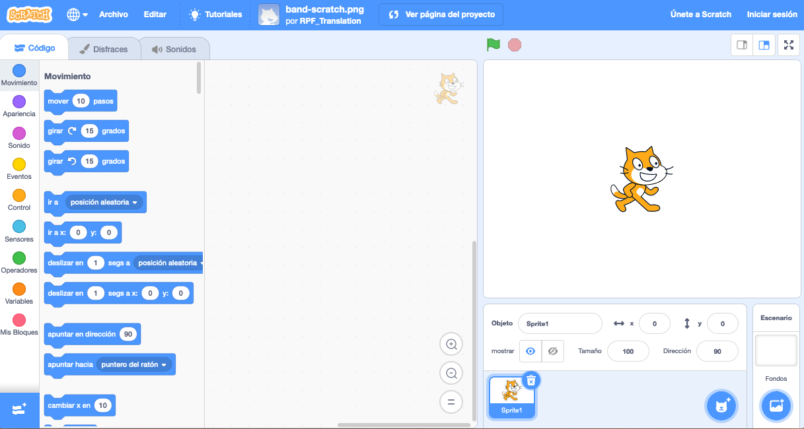
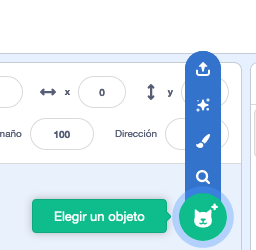
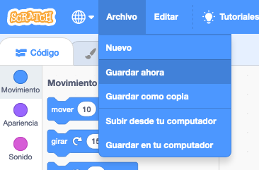

## Objetos

Antes de comenzar la codificación, necesitas añadir una “cosa” que animar. En Scratch, estas “cosas” se llaman **sprites** objetos.

\--- tarea \--- Abrir un nuevo proyecto Scratch.

** Online **: abra un nuevo proyecto Scratch en línea en [ rpf.io/scratchon ](http://rpf.io/scratchon)"}.

**Offline**: abra un nuevo proyecto en el editor fuera de línea.

Si necesitas descargar e instalar el editor offline de Scratch, puedes encontrarlo en [rpf.io/scratchoff](http://rpf.io/scratchoff){:target="_blank"}.

Se parece a esto:

 \--- / task \--- \--- task \--- El objeto del gato que puedes ver es la mascota Scratch. No lo necesitas para este juego, así que deshazte de él haciendo clic con el botón derecho y luego presionando ** delete** borrar.

 \--- /task \---

\--- Luego, haz clic en **Choose sprite from library** Selecciona un objeto de la biblioteca para abrir una lista con todos los objetos de Scratch.

 \--- /task \---

\--- task \--- Baja hasta encontrar el objeto de un tambor. Selecciona un tambor, y haz clic en “Ok” para añadirlo a tu proyecto.

\--- /task \---

\--- task \---

Haga clic y arrastre el tambor a la parte inferior del escenario.

\--- /task \---

\--- task \--- Dale un nombre a tu programa escribiéndolo en el cuadro de texto en la esquina superior.

Para guardar tu proyecto, puedes hacer clic en **File** Archivo y luego en **Save now** Guardar ahora.

Si no estás en línea o no tiene una cuenta de Scratch, puede guardar una copia de su proyecto haciendo clic en ** Save to your computer ** Guardar en su computadora.

 \--- /task \---