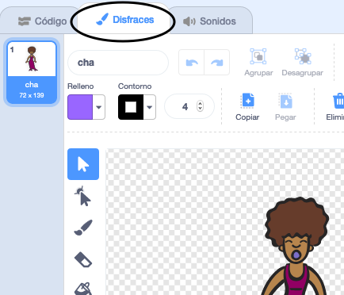

## Disfraces

¡Ahora harás que tu cantante se vea como si estuviera cantando!

\--- task \--- Puedes cambiar el aspecto de tu sprite de cantante cuando se hace clic creando un nuevo disfraz. Haz clic en la pestaña de Disfraces, y verás el disfraz de cantante.

 \--- / tarea \---

\--- task \--- Haz clic derecho en el disfraz y luego clica en **duplicate** duplicar para crear una copia del disfraz.

 \--- / tarea \---

\--- task \--- Haz clic en el nuevo disfraz (llamado 'Cantante2'), luego selecciona la herramienta línea y dibuja líneas para que parezca que tu cantante esté cantando.

 \--- función \---

\--- task \--- Los nombres de los disfraces no son muy útiles en este momento. Escriba en los cuadros de texto de los trajes para cambiar sus nombres a "no cantar" y "cantar".

 \--- / tarea \---

\--- task \--- Ahora que tienes dos disfraces diferentes para tu cantante, ¡puedes escoger cual de ellos se visualiza! Agrega estos dos bloques a tu cantante:

```blocks3
cuando este sprite hizo clic en
+ cambia el disfraz a (canto v)
reproduce el sonido (cantante1 v) hasta que se hace
+ cambia el disfraz a (no canta v)
```

El bloque de código para cambiar de disfraz se encuentra en la pestaña Apariencia `Looks` {:class="blocklooks"}

\--- task\--- Haz clic en tu cantante en el escenario. ¿Se ve como si estuviera cantando? \--- /task\---

\--- task\--- Ahora haz que tu tambor se vea como si estuviera siendo golpeado!


- Usa las instrucciones para cambiar el traje de tu objeto del cantante para ayudarte.

¡Recuerda probar que tu nuevo código funciona! \--- /task\---