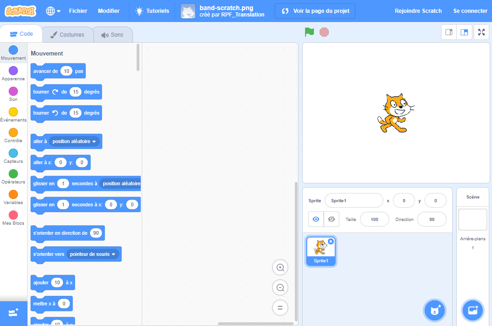
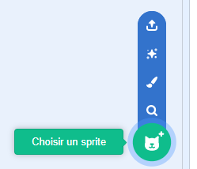
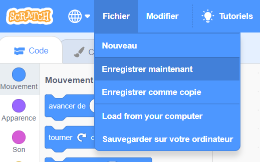

## Sprites

Avant de commencer à coder, vous devez ajouter une «chose» au code. Dans Scratch, ces «choses» sont appelées **sprites**.

--- task --- Ouvre un nouveau projet Scratch.

**En ligne:** ouvre un nouveau projet Scratch en ligne sur [rpf.io/scratch-new](http://rpf.io/scratch-new){:target="_blank"}.

**Hors ligne:** ouvre un nouveau projet dans l'éditeur hors ligne.

Si tu dois télécharger et installer l'éditeur hors ligne Scratch, tu peux le trouver à [rpf.io/scratchoff](http://rpf.io/scratchoff){:target="_blank"}.

Ça ressemble ça:

 --- /task --- --- task --- Le sprite de chat que tu peux voir est la mascotte de Scratch. Tu n’en as pas besoin pour ce jeu, alors tu peux t’en débarrasser en cliquant avec le bouton droit et puis en cliquant sur **supprimer**.

 --- /task ---

--- task --- Ensuite, clique sur **Choisir un sprite à partir de la bibliothèque** pour ouvrir une liste de tous les sprite Scratch.

 --- /task ---

--- task --- Fais défiler jusqu'à ce que tu trouves un sprite de tambour. Clique sur un tambour pour l'ajouter à ton projet.

--- /task ---

--- task ---

Clique et fais glisser le tambour en bas de la scène.

--- /task ---

--- task --- Donne un nom à ton programme en tapant dans la zone de texte en haut.

Puis, tu peux cliquer sur **Fichier**, et sur **Sauvegarder maintenant** pour enregistrer ton projet.

Si tu n’es pas en ligne, tu peux enregistrer une copie de ton projet en cliquant sur **Sauvegarder sur votre ordinateur**.

 --- /task ---