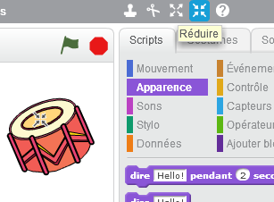

## Lutins

Avant de commencer à coder, vous devez ajouter une «chose» au code. Dans Scratch, ces 'choses' sont appelées ** lutins ** .

+ D'abord, ouvrez l'éditeur Scratch. Vous pouvez trouver l'éditeur en ligne de Scratch à <a href="http://jumpto.cc/scratch-new" target="_blank"> jumpto.cc/scratch-new </a> . Ceci ressemble a ça :
    
    

+ Le lutin de chat que vous pouvez voir est la mascotte Scratch. Débarrassons nous en en cliquant dessus avec le bouton droit puis ** supprimer ** .
    
    

+ Ensuite, cliquez sur ** Choisir un lutin dans la bibliothèque ** pour ouvrir une liste de tous les lutins Scratch.
    
    

+ Faites défiler jusqu'à ce que vous trouviez un lutin de tambour. Cliquez sur celui ci puis sur ** OK ** pour l'ajouter à votre projet.
    
    

+ Cliquez sur le lutin et **rétrécissez** le.
    
    

Give your program a name by typing one into the text box in the top left-hand corner.

You can then click **File** and then **Save now** to save your project. If you don't have a Scratch account, you can save a copy of your project by clicking **Download to your computer** instead.

