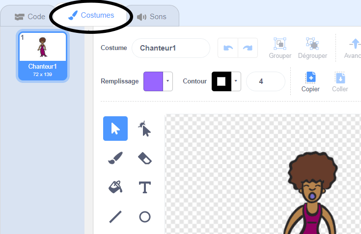
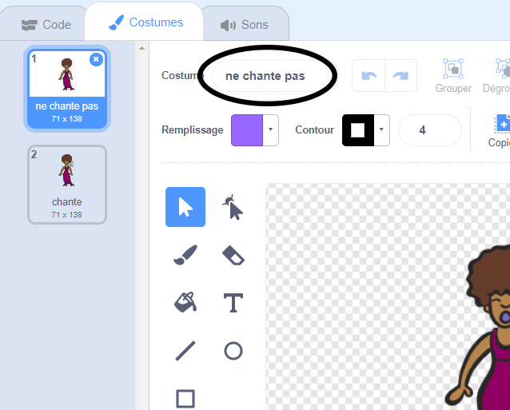

## Costumes

Maintenant, tu vas faire en sorte que l'on voit que ton chanteur ait l'air de chanter !

\--- tâche \--- Tu peux également modifier l'aspect de ton lutin chanteur en cliquant dessus et en créant un nouveau costume. Clique sur l'onglet Costumes, et tu verras le costume du chanteur.

 \--- /task \---

\--- tâche \--- Fait un clic droit sur le costume, puis clique sur **dupliquer** pour créer une copie du costume.

 \--- /task \---

\--- tâche \--- Clique sur le nouveau costume (appelé 'Singer2'), puis sélectionne l'outil ligne et dessine des lignes pour donner l'impression que ton chanteur émet un son.

 \--- /task \---

\--- tâche \--- Les noms des costumes ne sont pas très utiles pour le moment. Tape dans les boîtes de texte des costumes pour changer leurs noms à 'ne pas chanter' et 'chanter'.

 \--- /task \---

\--- tâche \--- Maintenant que tu as deux costumes différents pour ton chanteur, tu peux choisir quel costume est affiché ! Ajoute ces deux blocs de code à ton lutin chanteur :

```blocks3
when this sprite clicked
+switch costume to (singing v)
play sound (singer1 v) until done
+switch costume to (not singing v)
```

The code block for changing the costume is in the `Looks`{:class="block3looks"} section. \--- /task \---

\--- task \--- Click on your singer on the stage. Does she look like she is singing? \--- /task \---

\--- task \--- Now make your drum look like it's being hit!


- Use the instructions for changing your singer sprite's costume to help you.

Remember to test that your new code works! \--- /task \---