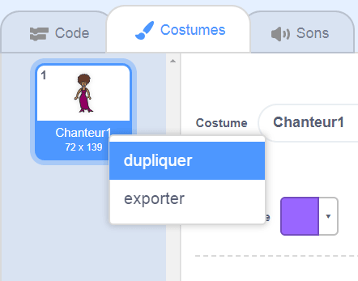
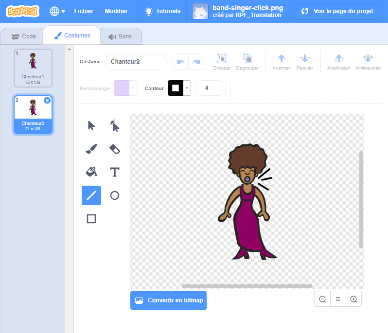

## Costumes

Maintenant, tu vas faire en sorte que l'on voit que ton chanteur ait l'air de chanter !

\--- task \--- Tu peux également modifier l'aspect de ton sprite chanteur en cliquant dessus et en créant un nouveau costume. Clique sur l'onglet Costumes, et tu verras le costume du chanteur.

 \--- /task \---

\--- task \--- Fais un clic droit sur le costume, puis clique sur **dupliquer** pour créer une copie du costume.

 \--- /task \---

\--- task \--- Clique sur le nouveau costume (appelé 'Singer2'), puis sélectionne l'outil ligne et dessine des lignes pour donner l'impression que ton chanteur émet un son.

 \--- /task \---

\--- task \--- Les noms des costumes ne sont pas très utiles pour le moment. Tape dans les boîtes de texte des costumes pour changer leurs noms à 'ne pas chanter' et 'chanter'.

 \--- /task \---

\--- task \--- Maintenant que tu as deux costumes différents pour ton chanteur, tu peux choisir quel costume est affiché ! Ajoute ces deux blocs de code à ton sprite chanteur :

```blocks3
lorsque ce sprite est cliqué
+ bascule le costume sur (chanter v)
jouer du son (singer1 v) jusqu'à ce que l'opération soit terminée
+ basculer costume sur (ne pas chanter v)
```

Le bloc de code pour changer le costume est dans la section `Apparence`{:class="block3looks"}. \--- /task \---

\--- task \--- Clique sur ta chanteuse sur la scène. Est-ce qu'elle semble en train de chanter ? \--- /task \---

\--- task \--- Maintenant tu vas faire en sorte que ton tambour ait l'air d'être frappé !


- Utilise les instructions pour changer le costume de ton sprite chanteur pour t'aider.

N'oublie pas de tester que ton nouveau code fonctionne \--- /task \---