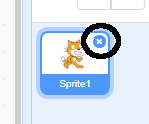

## स्प्राइट्स

इससे पहले कि आप कोडिंग आरंभ कर सकें, आपको कोड में 'चीज़' को जोड़ना होगा। Scratch में, इन 'चीज़' को **स्प्राइट्स** कहा जाता है।

\--- कार्य \--- एक नया स्क्रैच प्रोजेक्ट खोलें।

**ऑनलाइन:** [rpf.io/scratch-new](http://rpf.io/scratch-new){: target = "_ blank"} पर एक नया ऑनलाइन स्क्रैच प्रोजेक्ट खोलें।

**ऑफ़लाइन:** ऑफ़लाइन संपादक में एक नई परियोजना खोलें।

यदि आपको स्क्रैच ऑफ़लाइन संपादक को डाउनलोड और इंस्टॉल करने की आवश्यकता है, तो आप इसे [rpf.io/scratchoff](http://rpf.io/scratchoff) {:target="_blank"} पर पा सकते हैं।

यह इस तरह दिखता है:

 \--- [task \--- \--- task \--- बिल्ली जो आप देख सकती है, वह है स्क्रैच शुभंकर। आपको इस गेम के लिए इसकी आवश्यकता नहीं है, इसलिए इसे राइट-क्लिक करके हटा दें और फिर **डिलीट**पर क्लिक करें।

 \--- /task \---

\--- कार्य \--- अगला, सभी स्क्रैच स्प्राइट की सूची खोलने के लिए लाइब्रेरी</strong> से स्प्राइट चुनें **पर क्लिक करें।
 

 \--- /task \---

\--- कार्य \--- एक ड्रम स्प्राइट देखने तक नीचे स्क्रॉल करें। इसे अपने प्रोजेक्ट में जोड़ने के लिए ड्रम पर क्लिक करें।

\--- /task \---

\--- task \---

क्लिक करें और ड्रम को स्टेज के नीचे तक खींचें।

\--- /task \---

\--- कार्य \--- शीर्ष पर पाठ बॉक्स में लिखकर अपने कार्यक्रम को एक नाम दें।

इसके बाद अपने प्रोजेक्ट को सेव करने के लिए **फाइल**पर क्लिक करें और फिर **सेव** पर क्लिक करें।

आप ऑनलाइन नहीं होते या एक स्क्रैच खाता नहीं है, तो आप पर क्लिक करके अपनी परियोजना की एक प्रति बचा सकता है **आपके कंप्यूटर के लिए सहेजें** के बजाय।

 \--- /task \---