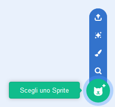

## Sprite

Prima di poter cominciare a programmare, hai bisogno di aggiungere al tuo progetto un ‘oggetto’ da programmare. In Scratch questi ‘oggetti’ si chiamano **sprite**.

+ Prima di tutto, apri l’editor di Scratch. Lo trovi online all’indirizzo <a href="http://jumpto.cc/scratch-new" target="_blank">jumpto.cc/scratch-new</a>. Ecco com'è fatto:
    
    

+ Lo sprite del gatto che vedi è la mascotte di Scratch. Rimuoviamolo cliccando col tasto destro del mouse sullo sprite e selezionando l’opzione **cancella**.
    
    

+ Poi fai click col mouse su **Scegli uno sprite dalla libreria** per aprire la lista con tutti gli sprite di Scratch.
    
    

+ Scorri verso il basso fino a che non trovi lo sprite di un tamburo. Seleziona uno dei due sprite e per aggiungerlo al progetto clicca sul tasto **OK** in basso a destra.
    
    

+ Premi l’icona **Riduci lo sprite** e poi fai clicca varie volte sul tamburo per rimpicciolirlo.
    
    

Dai un nome al tuo programma scrivendolo nella casella di testo nell’angolo in alto a sinistra.

Per salvare il progetto, seleziona la voce **Salva ora** dal menu **File**. Se non hai un account Scratch, puoi comunque salvare una copia del tuo progetto selezionando **Download sul tuo computer**.

