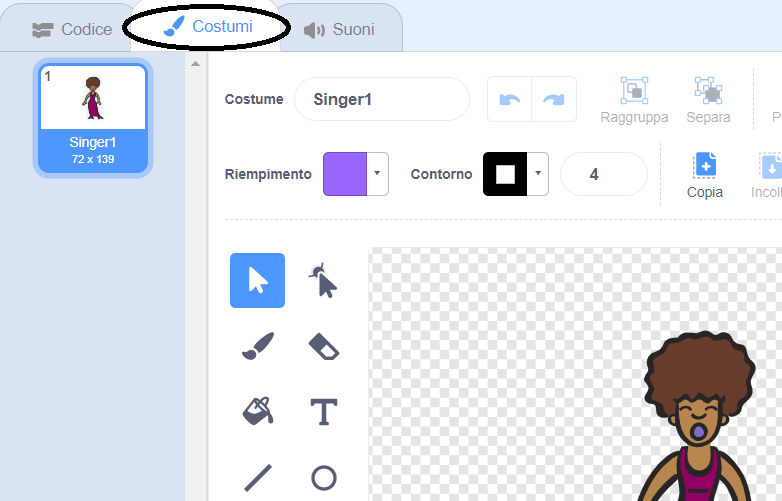
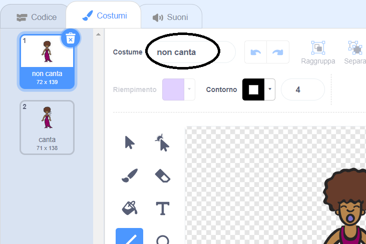

## I Costumi

Ora farai sembrare il tuo cantante come lei sta cantando!

\--- task \--- Puoi cambiare il modo in cui appare il tuo sprite del cantante quando viene cliccato creando un nuovo costume. Fai clic sulla scheda Costumi e vedrai il costume del cantante.

 \--- /task \---

\--- task \--- Fare clic con il pulsante destro del mouse sul costume e quindi fare clic su **duplicato** per crearne una copia.

 \--- /task \---

\--- task \--- Fai clic sul nuovo costume (chiamato 'Singer2'), quindi seleziona lo strumento linea e traccia le linee in modo che il tuo cantante emetta un suono.

 \--- /task \---

\--- task \--- I nomi dei costumi non sono molto utili al momento. Digita nelle caselle di testo dei costumi per cambiarne il nome in "non cantare" e "cantare".

 \--- /task \---

\--- task \--- Ora che hai due costumi diversi per il tuo cantante, puoi scegliere quale costume è visualizzato! Aggiungi questi due blocchi di codice al tuo sprite del cantante:

```blocks3
quando questo sprite fa clic su
+ passa costume a (cantando v)
suono riprodotto (cantante1 v) fino a quando
+ passa costume a (non cantando v)
```

Il blocco di codice per la modifica del costume si trova nella sezione `Looks`{: class = "block3looks"}. \--- / compito \---

\--- compito \--- Clicca sul tuo cantante sul palco. Sembra che stia cantando? \--- / compito \---

\--- task \--- Ora fai in modo che il tuo tamburo sia colpito!


- Usa le istruzioni per cambiare il costume del tuo sprite del cantante per aiutarti.

Ricordati di verificare che il tuo nuovo codice funzioni! \--- / compito \---