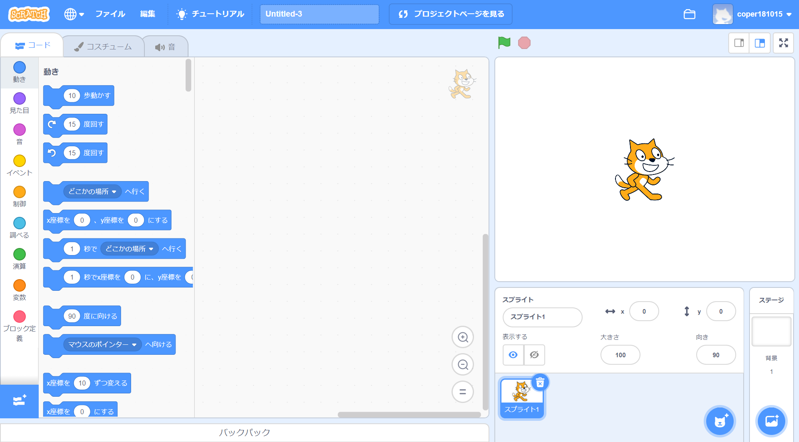
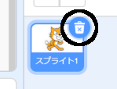
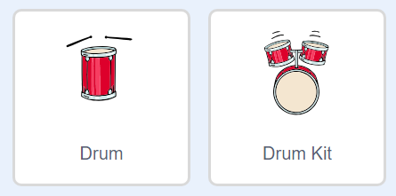

## スプライト

コーディングをはじめる前に、ある「モノ」を取り入れる必要があります。この「モノ」はScratch(スクラッチ)では**スプライト**と呼ばれています。

\--- task \--- Open a new Scratch project.

**Online: **新しいオンラインScratchプロジェクトを[rpf.io/scratch-new](http://rpf.io/scratch-new){:target="_blank"}で開きます。

**Offline:**オフラインエディターで新しいプロジェクトを開きます。

Scratchオフラインエディタをダウンロードしてインストールする必要がある場合は、[rpf.io/scratchoff](http://rpf.io/scratchoff){:target="_blank"}で見つけることができます。:

このような感じになります。

 \--- /task \--- \--- task \--- 見えている猫のスプライトは、Scratchマスコットです。このゲームには必要ないので、右クリックして**削除**をクリックして削除します。

 \--- /task \---

\--- task \--- 次に、すべてのScratchスプライトのリストを開くために**ライブラリからスプライトを選択する**をクリックします。

 \--- /task \---

\--- task \--- ドラムスプライトが表示されるまで下にスクロールします。ドラムをクリックして、プロジェクトに追加します。

\--- /task \---

\--- task \---

ドラムをクリックしてステージの下部までドラッグします。

\--- /task \---

\--- task \--- 上部のテキストボックスに入力して、プログラムに名前を付けます。

**ファイル** をクリックし、**今すぐ保存**をクリックするとプロジェクトを保存することができます。

If you are not online or don't have a Scratch account, you can save a copy of your project by clicking on **Save to your computer** instead.

 \--- /task \---