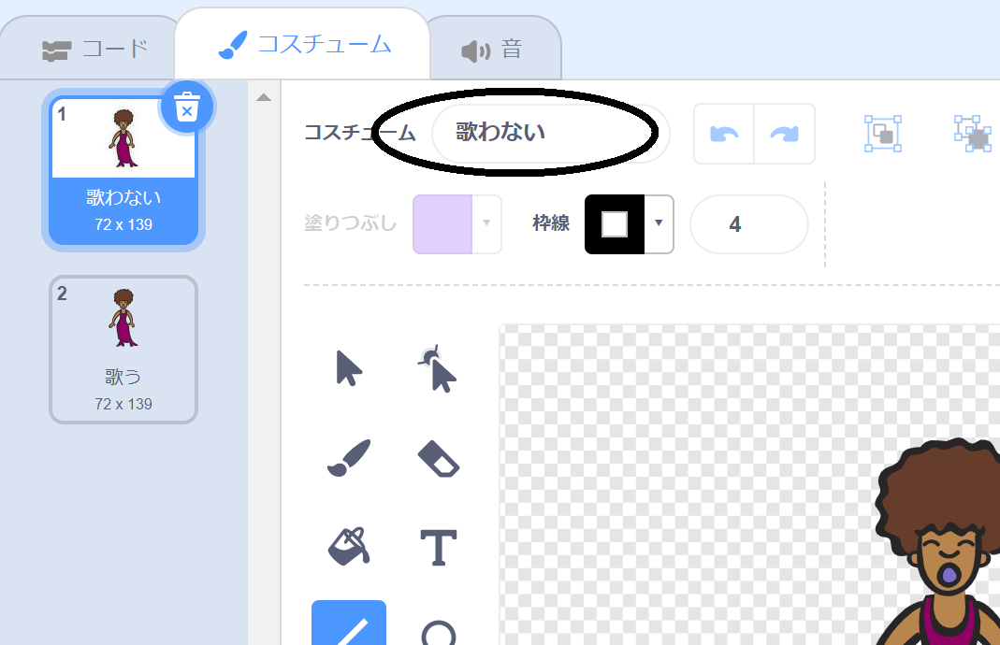

## コスチューム

歌手が歌っているように見せましょう！

\--- task \--- 新しいコスチュームを作成することで、クリックしたときに歌手のスプライト見え方を変えることができます。コスチュームタブをクリックすると、歌手のコスチュームが表示されます。

 \--- /task \---

\--- task \--- コスチュームを右クリックし、**複製**をクリックするとコピーを作成します。

 \--- /task \---

\--- task \--- 新しいコスチューム(「Singer2」という名前です) をクリックし、ラインツールを選択して、ラインを引きます、すると歌手が音を出しているように見えます。

 \--- /task \---

\--- task \--- コスチュームの名前は今のところあまり役に立ちません。コスチュームのテキストボックスに入力して、名前を「歌わない」と「歌う」に変更します。

 \--- /task \---

\--- task \--- 歌手のコスチュームが2種類になったので、表示する衣装を選択できます！これら2つのコードブロックを歌手のスプライトに追加します。

```blocks3
このスプライトがクリックされたとき
+コスチュームを(歌うv) に切り替える
サウンドを再生する(singer1 v) 終了するまで
+コスチュームを(歌わないv) に切り替える
```

コスチュームを変更するためのコードブロックは` 見た目` {：class = "block3looks"}セクションにあります。 \--- /task \---

\--- task \--- ステージの歌手をクリックします。彼女は歌っているように見えますか？ \--- /task \---

\--- task \--- ドラムが叩かれているように見せてください！


- 歌手のスプライトのコスチュームを変更する手順に従ってください。

新しいコードが動くことをテストするのを忘れないようにしましょう！ \--- /task \---