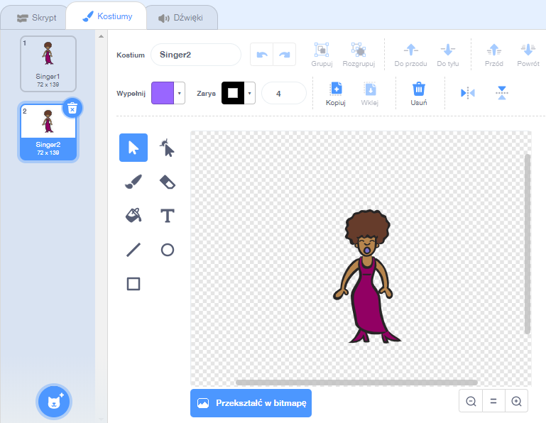

## Kostiumy

Teraz sprawisz, że twoja wokalistka będzie wyglądała, jakby śpiewała!

\--- task \--- Możesz zmienić wygląd duszka wokalistki, gdy zostanie kliknięty tworząc nowy kostium. Kliknij zakładkę Kostiumy, a zobaczysz kostium wokalistki.

 \--- /task \---

\--- task \--- Kliknij kostium prawym przyciskiem myszy, a następnie kliknij **duplikuj**, aby utworzyć jego kopię.

 \--- /task \---

\--- task \--- Kliknij nowy kostium (nazwany „Wokalistka2”), a następnie wybierz narzędzie linii i narysuj linie, aby wyglądało na to, że wokalistka wydaje dźwięk.

 \--- /task \---

\--- task \--- Nazwy kostiumów nie są w tej chwili bardzo pomocne. W pola tekstowe kostiumów wpisz odpowiedni tekst, aby zmienić ich nazwy na „nie śpiewa” i „śpiewa”.

 \--- /task \---

\--- task \--- Teraz, kiedy masz dwa różne kostiumy dla swojej wokalistki, możesz wybrać, który kostium zostanie wyświetlony! Dodaj te dwa bloczki kodu do duszka wokalistki:

```blocks3
when this sprite clicked
+switch costume to (singing v)
play sound (singer1 v) until done
+switch costume to (not singing v)
```

Bloczek kodu do zmiany kostiumu znajduje się w sekcji `Wyglądy`{:class="block3looks"}. \--- /task \---

\--- task \--- Kliknij na wokalistkę na scenie i zobacz co się stanie. Czy ona wygląda jakby śpiewała? \--- /task \---

\--- task \--- Teraz spraw, by twój bębenek wyglądał, jakby został uderzony!


- Żeby sobie pomóc, skorzystaj z instrukcji zmiany kostiumu duszka wokalistki.

Pamiętaj, aby przetestować, czy Twój nowy kod działa! \--- / task \---