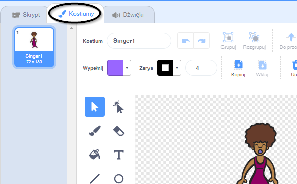
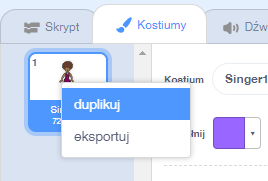
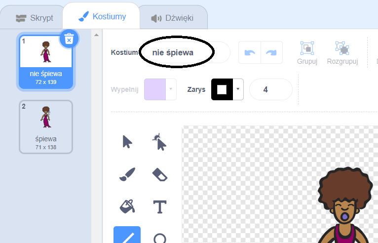

## Kostiumy

Teraz sprawisz, że twoja wokalistka będzie wyglądała, jakby śpiewała!

--- task --- Możesz zmienić wygląd duszka wokalistki, gdy zostanie kliknięty tworząc nowy kostium. Kliknij zakładkę Kostiumy, a zobaczysz kostium wokalistki.

 --- /task ---

--- task --- Kliknij kostium prawym przyciskiem myszy, a następnie kliknij **duplikuj**, aby utworzyć jego kopię.

 --- /task ---

--- task --- Kliknij nowy kostium (nazwany „Singer2”), a następnie wybierz narzędzie linii i narysuj linie, aby wyglądało na to, że wokalistka wydaje dźwięk.

 --- /task ---

--- task --- Nazwy kostiumów nie są w tej chwili bardzo pomocne. W pola tekstowe kostiumów wpisz odpowiedni tekst, aby zmienić ich nazwy na „nie śpiewa” i „śpiewa”.

 --- /task ---

--- task --- Teraz, kiedy masz dwa różne kostiumy dla swojej wokalistki, możesz wybrać, który kostium zostanie wyświetlony! Dodaj te dwa bloczki kodu do duszka wokalistki:

```blocks3
kiedy ten duszek kliknięty
+zmień kostium na (śpiewa v)
graj dźwięk (singer1 v) aż się skończy
+zmień kostium na (nie śpiewa v)
```

Bloczek kodu do zmiany kostiumu znajduje się w sekcji `Wygląd`{:class="block3looks"}. --- /task ---

--- task --- Kliknij na wokalistkę na scenie i zobacz co się stanie. Czy ona wygląda jakby śpiewała? --- /task ---

--- task --- Teraz spraw, by twój bębenek wyglądał, jakby został uderzony!


- Żeby sobie pomóc, skorzystaj z instrukcji zmiany kostiumu duszka wokalistki.

Pamiętaj, aby przetestować, czy Twój nowy kod działa! --- /task ---