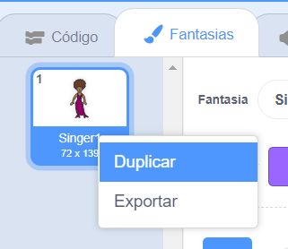
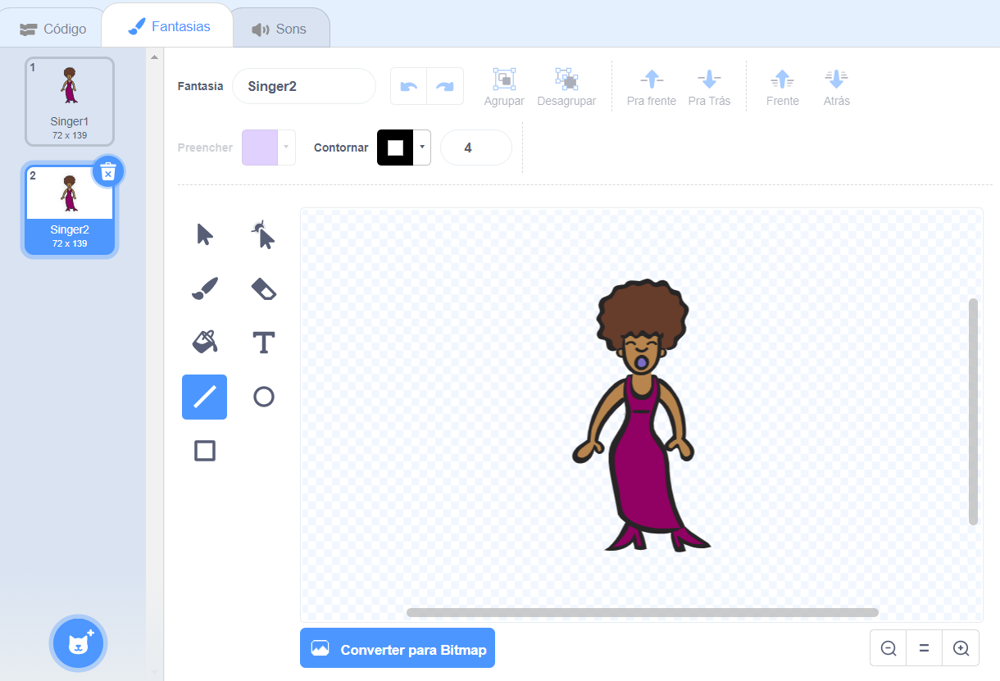
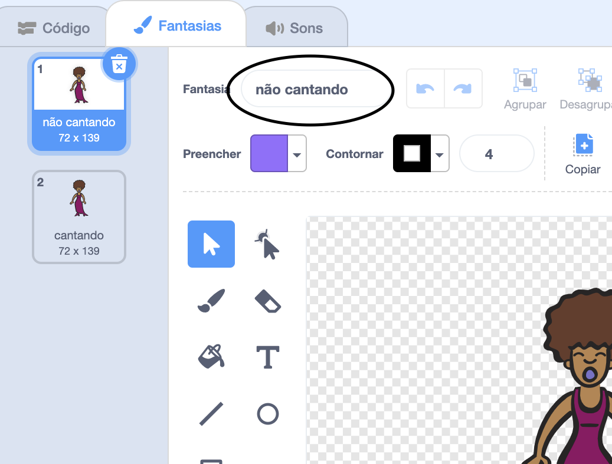

## Fantasias

Agora vamos fazer sua cantora parecer que está cantando!

\--- task \--- Você pode mudar a aparência do seu ator de cantora quando ela é clicada. Para fazer isso você precisa criar uma nova fantasia. Clique na aba Fantasias e você verá a imagem da cantora.

 \--- /task \---

\--- task \--- Clique com o botão direito na fantasia e selecione **duplicar** para criar uma cópia dela.

 \--- /task \---

\--- task \--- Clique na fantasia nova (chamada 'Singer2'), e então selecione a ferramenta de linha e desenhe linhas para fazer parecer que a sua cantora está cantando.

 \--- /task \---

\--- task \--- Os nomes atuais das fantasias não são muito úteis. Digite nas caixas de texto das fantasias para mudar seus nomes para 'não cantando' e 'cantando'.

 \--- /task \---

\--- task \--- Agora que você tem duas fantasias diferentes para sua cantora, você pode escolher qual delas será exibida! Adicione esses dois blocos de código ao seu ator de cantora:

```blocks3
quando este ator for clicado
+ mude para a fantasia (cantando v)
toque o som (singer1 v) até o fim
+ mude para a fantasia (não cantando v)
```

O bloco de código para trocar as fantasias está na seção `Aparência` {:class="block3looks"}. \--- /task \---

\--- task \--- Clique na sua cantora no palco. Parece que ela está cantando? \--- /task \---

\--- task \--- Agora faça com que seu tambor pareça que está sendo tocado!


- Use a ajuda das instruções para mudar o ator da fantasia da sua cantora.

Lembre-se de testar se o seu novo código funciona! \--- /task \---