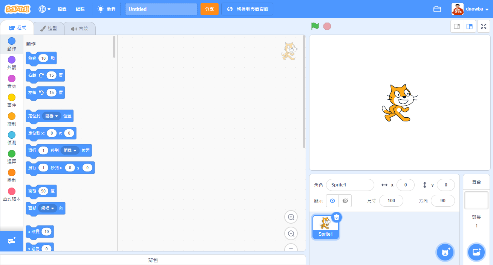
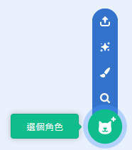

## 角色

在你開始編碼之前，你需要添加一個'東西'來編碼。在Scratch中，這些'東西'被稱為 **角色**。

\--- task \--- 建立一個新的 Scratch 專案。

**線上版：**你可以連結 [rpf.io/scratch-new](http://rpf.io/scratch-new){:target="_blank"} 以新建專案。

**離線版：**在離線編輯器的工作列中開啟選單並點擊新建專案。。

如果你需要 Scratch 離線版編輯器，可以連結到 [rpf.io/scratchoff](http://rpf.io/scratchoff){:target="_blank"}。

它看起來會像這樣：

 \--- /task \--- \--- task \--- 首先你會看到一隻貓，這個角色是 Scratch 的代表吉祥物。在這個遊戲裡你不需要牠，因此你可以在角色的縮圖區上點擊**垃圾桶**圖示來刪除牠。

 \--- /task \---

\--- task \--- 接下來，點擊**選個角色**以打開範例角色庫。

 \--- /task \---

\--- task \--- 滾動頁面直到看到 drum（鼓）。在角色圖案上點一下就可以把它添加到專案。

\--- /task \---

\--- task \---

單擊並將鼓拖到舞台底部。

\--- /task \---

\--- task \--- 在頂部的文本框中輸入您的程序名稱。

然後單擊 **文件**，然後單擊 **保存** 以保存項目。

如果您不在線或沒有Scratch帳戶，則可以通過單擊 **保存到計算機** 來保存項目的副本。

 \--- /task \---